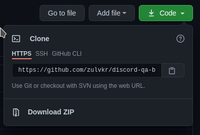
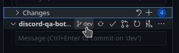
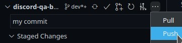
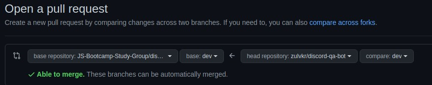

# Contributing

## Table of Contents

- [Contributing](#contributing)
  - [Table of Contents](#table-of-contents)
  - [Step 1: Clone 🐑](#step-1-clone-)
  - [Step 2: Checkout 💰](#step-2-checkout-)
  - [Step 3: Edit 🖊️](#step-3-edit-️)
  - [Step 4: Staging 🏋️‍♂️](#step-4-staging-️️)
  - [Step 5: Push 🔝](#step-5-push-)
  - [Step 6: Make a Pull Request ✋](#step-6-make-a-pull-request-)
  - [Step 7: Keep your fork in sync ↩️](#step-7-keep-your-fork-in-sync-️)
  - [Contribute Easier and Faster](#contribute-easier-and-faster)

Start contributing by forking this GitHub repo in your account! Fork button is on the top-right.

## Step 1: Clone 🐑

After you fork this repo, clone your fork to your local system. You can use GitHub desktop, VSCode or terminal to do this.



In VScode, click `Ctrl + Shift + P` and type clone, pick git clone, then paste your forked git address.


```bash
cd my-folder
git clone https://github.com/{{ your-username }}/discord-qa-bot.git
```

Download the zip file and extract it is also cloning so you can do that too.

## Step 2: Checkout 💰

Open your cloned folder then checkout to dev branch. This option can be seen in VSCode source control view `Ctrl + Shift + G`.



```bash
cd discord-qa-bot
git checkout dev
```

## Step 3: Edit 🖊️

Edit the files and save. Add your name to contributor list if you want to!

## Step 4: Staging 🏋️‍♂️

After editing you can stage and commit your changes. Click + to stage your change on each files. Then commit it to dev branch by clicking ✅


```bash
git add README.md
git commit -m 'add my name to contibutor list'
```

## Step 5: Push 🔝

Push your commit to your forked repository in GitHub by click ... then push.



```bash
git push origin dev
```

## Step 6: Make a Pull Request ✋

Last step on your part, open your GitHub repo. If your changes has been pushed correctly, you will see the Pull Request button. Make a pull request to dev branch of main repository.




And we are finally done.

## Step 7: Keep your fork in sync ↩️

Your fork will get "outdated" after other people make changes to the main repository. GitHub has nice button to pull changes from main (upstream) repository to your fork.


Then you can pull the updated fork to your local repository.


```bash
git pull origin master
```

Thus your repository will be in linear relationship:

local 🔁 fork 🔁 upstream.

This is what I prefer to avoid confusion. The usual way is [triangle workflow.](https://github.com/forwards/first-contributions/blob/master/additional-material/git_workflow_scenarios/keeping-your-fork-synced-with-this-repository.md)

## Contribute Easier and Faster

Forking makes git workflow a bit cumbersome but safer. To iterate faster, you could join this team to get access to push to main repo directly, skip forking and pull request step.

Please be careful on pushing to dev and main branch. It's better to make your own branch instead for safety purpose.

[Access to this Repo team](https://github.com/orgs/JS-Bootcamp-Study-Group/teams/access-to-discord-qa-bot-repo)

You can push directly to dev if you think it's appropriate, but please make new branch for any big update so everyone can test first.
