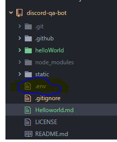
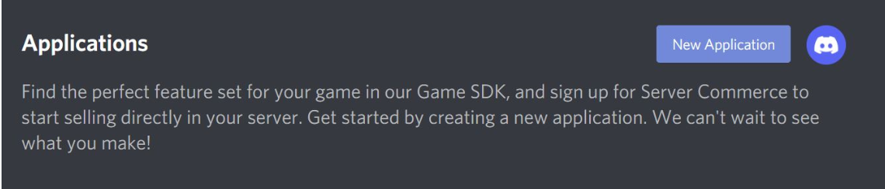
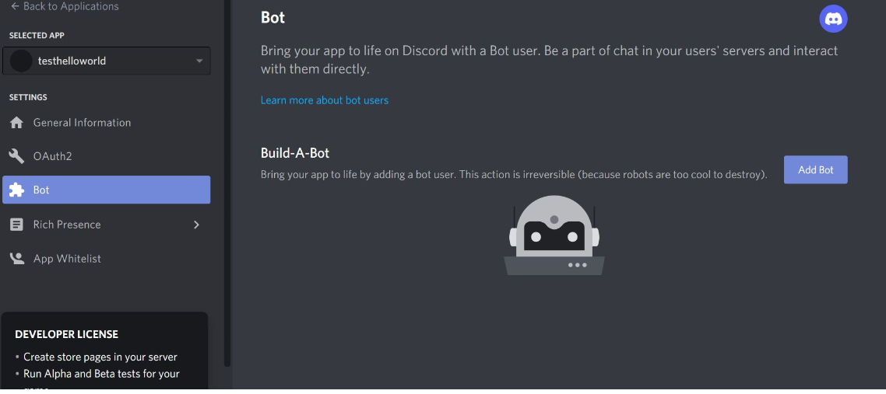
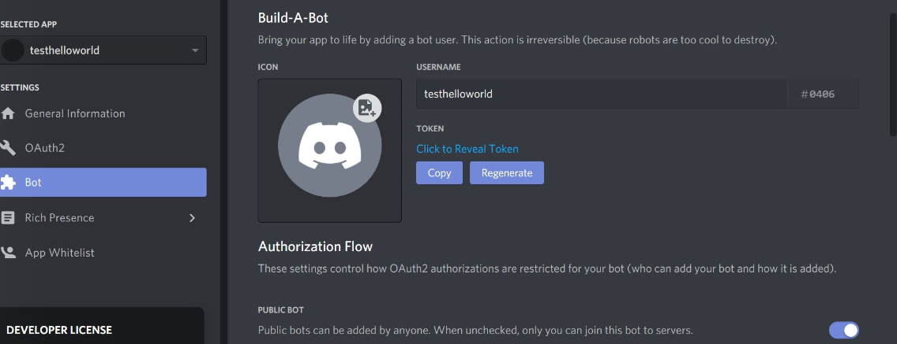
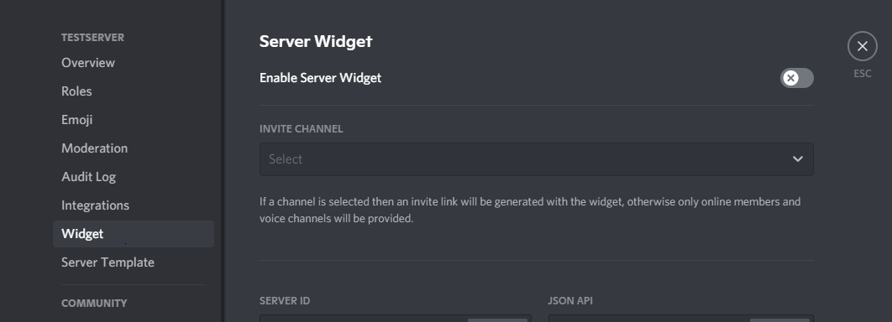
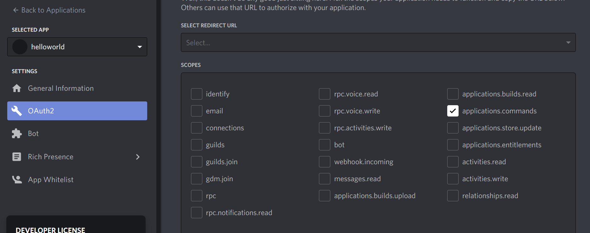

#Hello World, welcome to the humble beginnings.

# Prerequistes:

npm is installed

a discord account :)

#Install discord  and dotenv
open your discord-qa-bot project in your code editor of your choice. 

use the command in terminal if you do not have discordjs or dotenv  installed yet
` npm i dotenv discord.js`

add a file to discord-qa-bot   project called .env
(create new file and save as .env)

for now we will leave it empty

#create your own test bot

go to discord developer portal
https://discord.com/developers/applications/

click on new application on the top right hand side

then enter your bots name into the field and click create

then go to add bot

then click on reveal token and copy token.

add this token into your .env  file as a key value structure as :
BOT_TOKEN=yourcopiedtoken

#create your own test server on Discord

when you are logged in to discord on the left side, there is a plus sign on the bottom
click on the plus sign and create your own test server.

under settings go to widget
get your server id,

go back to your  your .env file and insert  it as :
SERVER_ID=yourcopiedserverid.

#add your bot to your server

go back to your  discord dev portal
https://discord.com/developers/applications/

select your bot and go und oAuth, there select the scope (in our case we want to add slash commands)

then copy the link under scope and insert into your browser. 

Select your server and confirm the captcha.
your bot should now be added to your server. 

# run the application

use commandline (cd command) to go  into the folder in which you cloned the project

then run the following command. 
`node helloworld.js`
it should then say ready to bot. 
test the bot in your test server!!!

