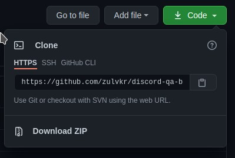
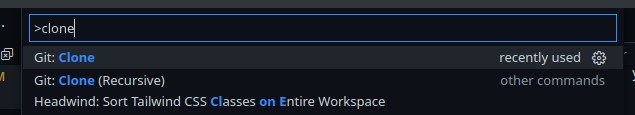
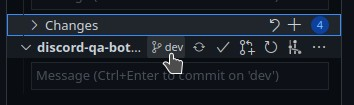
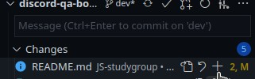
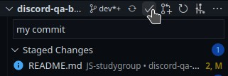
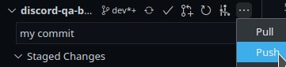
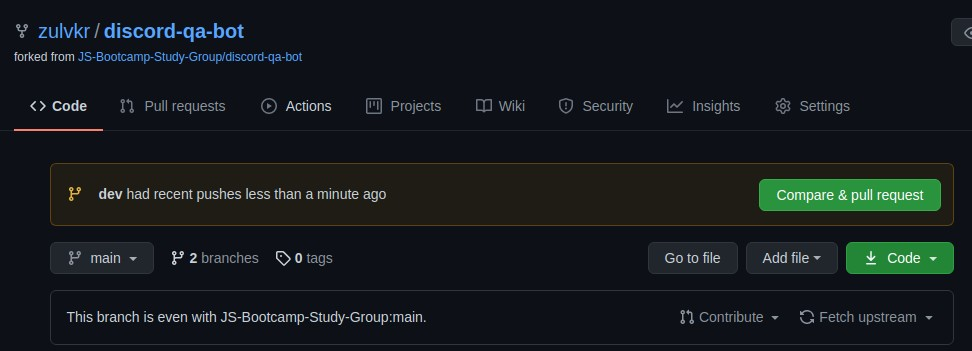
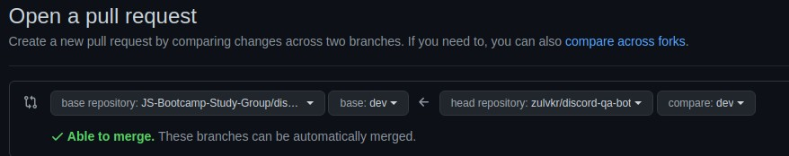

# Discord Question and Answer Bot

A discord QA bot intended for learning purpose of JS Bootcamp study group

Hi everyone, I hope you can get onboard on this project easier, so I create a readme for contributing.

## Table of Contents

- [Discord Question and Answer Bot](#discord-question-and-answer-bot)
  - [Table of Contents](#table-of-contents)
  - [Contributing](#contributing)
    - [Step 1: Clone 🐑](#step-1-clone-)
    - [Step 2: Checkout 💰](#step-2-checkout-)
    - [Step 3: Edit 🖊️](#step-3-edit-️)
    - [Step 4: Staging 🏋️‍♂️](#step-4-staging-️️)
    - [Step 5: Push 🔝](#step-5-push-)
    - [Step 6: Make a Pull Request ✋](#step-6-make-a-pull-request-)
    - [Step 7: Repeat ↩️](#step-7-repeat-️)
  - [Contribute Easier and Faster](#contribute-easier-and-faster)
  - [Contributor](#contributor)

## Contributing

Start contributing by forking this GitHub repo in your account! Fork button is on the top-right.

### Step 1: Clone 🐑

After you fork this repo, clone your fork to your local system. You can use GitHub desktop, VSCode or terminal to do this.



In VScode, click `Ctrl + Shift + P` and type clone, pick git clone, then paste your forked git address.



```bash
cd my-folder
git clone https://github.com/{{ your-username }}/discord-qa-bot.git
```

Download the zip file and extract it is also cloning so you can do that too.

### Step 2: Checkout 💰

Open your cloned folder then checkout to dev branch. This option can be seen in VSCode source control view `Ctrl + Shift + G`.



```bash
cd discord-qa-bot
git checkout dev
```

### Step 3: Edit 🖊️

Edit the files and save. Add your name to contributor list if you want to!

### Step 4: Staging 🏋️‍♂️

After editing you can stage and commit your changes. Click + to stage your change on each files. Then commit it to dev branch by clicking ✅





```bash
git add README.md
git commit -m 'add my name to contibutor list'
```

### Step 5: Push 🔝

Push your commit to your forked repository in GitHub by click ... then push.



```bash
git push origin dev
```

### Step 6: Make a Pull Request ✋

Last step on your part, open your GitHub repo. If your changes has been pushed correctly, you will see the Pull Request button. Make a pull request to dev branch of main repository.





And we are finally done.

### Step 7: Repeat ↩️

You can contribute further by repeating Step 3 to Step 6. Sometimes you will find conflict between your fork and main repo due to other people has make changes to repo. You have to update your repo first by [resolve conflict](https://stackoverflow.com/questions/38949951/how-to-solve-merge-conflicts-across-forks).

## Contribute Easier and Faster

Forking makes git workflow a bit cumbersome but safer, you could join this team to get access to push main repo directly. Please be careful on pushing to dev and main branch. It's better to make your own branch instead for safety purpose.

[Access to this Repo team](https://github.com/orgs/JS-Bootcamp-Study-Group/teams/access-to-discord-qa-bot-repo)

You can push directly to dev if you think it's appropriate, but please make new branch for any big update so everyone can test first.

## Contributor

Contributor listed here in alphabetical order:

1. @zulvkr
2. @projectrevolution
3. @caterpillareffect
